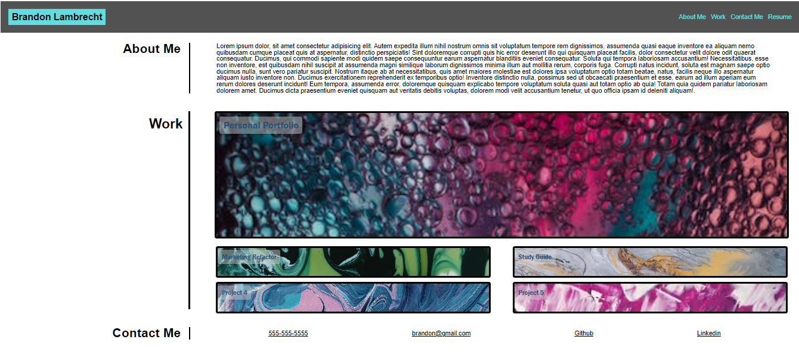

# Personal-Portfolio
 

## Description

This repository showcases my personal portfolio with sections: about me, work, and contact me. The navigation bar is linked to each section for user efficiency. The work section includes 5 projects linked to there respected repository in Github. Once a project is complete, the links open to the deployed webpage of each project. Finally the contact me section will list relevant contact information along with a link to my Github and LinkedIn.

The goal of this project:

    - Create a visually appealing webpage
    - Create a download link displaying my resume
    - Link each project to its respective repository
    - Use flexbox, responsive design, links and pseudo classes 
    - Showcase my portfolio to potential employers
    
    The motivation behind this project is to create a visually appealing and well-organized portfolio showcasing the skills I have learned to this point. The portfolio will be updated frequently displaying the most up to date projects. 

## Installation

To use project locally, follow these steps:

1. Clone repository to local machine 
    - git clone https://github.com/brandonlambrecht/personal-portfolio

2. Open 'index.html' in your web browser 

## Usage

1. See link for snap shot of Personal Portfolio webpage.
Image

2. Follow deployed link for full access to webpage
Webpage
